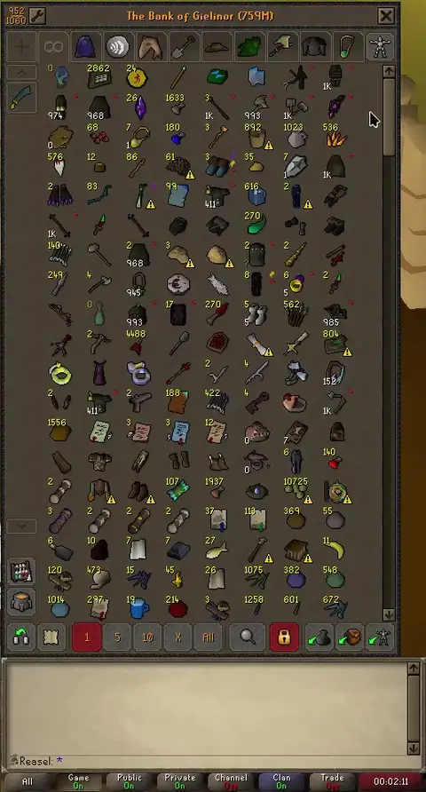

# Bank Highlight Search

Search your bank without losing sight of it. Press a hotkey (default **Ctrl+Shift+F**),
type a query, and matching items get a blinking highlight — instead of the native
search behavior of hiding everything else. Press **Enter** to jump to the ALL tab and
scroll the matches into view.

## Features

- Bindable hotkey opens a search prompt (only while the bank is open) — or right-click the bank's built-in search button
- Live highlighting as you type — items blink briefly, then stay outlined (blink duration 0 = blink forever)
- Six highlight styles: item outline, outline + fill, feathered pulse, box border, underline, filled box
- Feathered pulse: the outline glow breathes instead of blinking, with tunable min/max thickness
- Press Enter to keep highlights (until bank close or a new search); Esc cancels them instantly
- Enter switches to the ALL tab and scrolls to where the most matches are visible
- Matches charge/dose variations (Prayer potion(1–4), jewellery charges) — toggleable
- Highlights placeholders too — toggleable
- Configurable outline and fill colors, and blink/highlight durations

This plugin never modifies the native bank search or filters items — it only draws on top.
